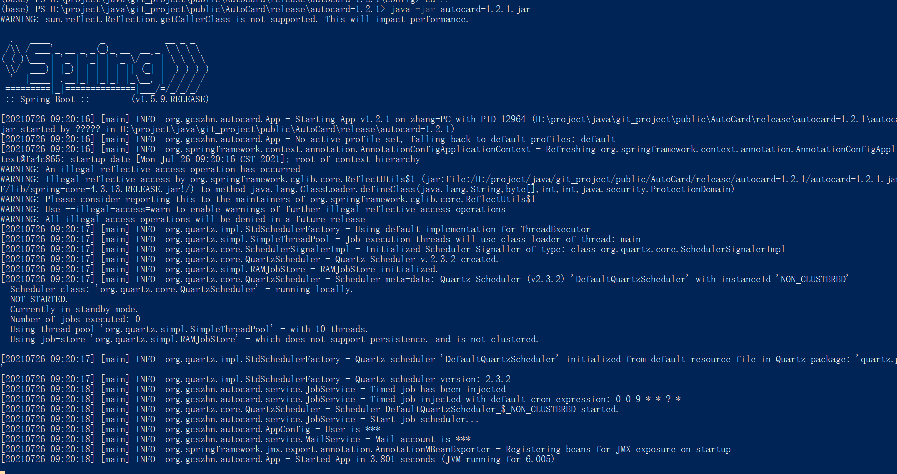

<h1 style="text-align: center">浙江大学自动健康打卡AutoCard</h1>
<div style="text-align: center">


</div>

## 项目概述
本项目为解决浙江大学每日重复的健康打卡而开发，在完成首次手动打卡后，可以自动进行定时打卡。并通过邮件形式提醒通知打卡结果。本项目使用spring-boot、quartz和httpclient开发，使用maven进行项目管理，编译版本为jdk-14.0.2。支持多账户配置。

## 基本使用步骤
**STEP 1 用来跑程序的设备**

定时打卡任务意味着程序需要一直保持运行，因此个人建议将项目运行在一台服务器上。阿里云、华为云、腾讯云等都提供许多服务器租赁。当然，你要是保持个人电脑一直不关，那么用个人电脑也OK。

**STEP 2 安装java语言**

正如所说，本项目是一个java项目（src文件夹源码文件是*.java），因此需要用户事先安装java语言。作者的发行版用的是jdk-14.0.2，即java SE 14.0.2，[官方下载地址](https://www.oracle.com/java/technologies/javase/jdk14-archive-downloads.html)。根据自己设备的操作系统选择对应的安装包即可。

|安装包扩展名 |对应系统                  |
|:----------|:------------------------|
|deb        |Linux发行版的Debian/Ubuntu|
|rpm        |Linux发行版的CentOS       |
|dmg        |MacOS                    |
|exe        |Win                      |

**STEP 3 下载作者提供的发行版**

在[gitee](https://gitee.com/GCSZHN/AutoCard/releases/)或[github](https://github.com/GCS-ZHN/AutoCard/releases)的项目发行版页面，下载最新的发行版（autocard-XXX.zip，XXX为版本号）。并解压。可以看到解压后目录结构如下
```txt
--autocard-XXX/
----autocard-XXX.jar                    ## 核心java程序，是编译后打包的jar包
----startup.sh                          ## 在linux下，用于启动java程序的shell脚本
----shutdown.sh                         ## 在linux下，用于关闭java程序的shell脚本
----config/
------application.json                  ## 用户配置，如账号密码等
------log4j2.xml                        ## 日志配置，不用修改
```
**STEP 4 修改application.json**

用任意文本编辑器打开config目录下的application.json，配置下列信息。
```json
{
    "mail":{                           //配置发送邮件通知的邮箱
        "username":"***",              //用来发送邮件的账号
        "nickname":"AutoCard",         //发件名
        "password":"***",              //发件邮箱密码
        "smtp":"smtp.zju.edu.cn",      //SMTP邮件服务运营商服务器域名，默认浙大邮箱
        "port":994                     //SMTP邮件服务端口
    },
    "jobs":[                           //配置多个打卡账号
        {
            "username":"***",          //打卡的通行证账号1，即学工号
            "password":"***",          //对应登录密码
            "mail":"***",              //发送打卡结果的收件邮箱
            "cron":"0 0 0 * * ? *",    //cron表达式定时，示例为每天00:00:00
            "delay":true               //任务开启随机延时0-1800秒
            },
            {
            "username":"***",          //打卡的通行证账号2
            "password":"***",          //对应登录密码
            "mail":"***",              //发送打卡结果的收件邮箱
            "cron":"0 0 2 * * ? *"     //cron表达式定时，示例为每天02:00:00
        }
    ]
}
```
邮箱用于打卡的通知，默认使用浙大邮箱，否则需要`mail.smtp`和`mail.port`参数配置为指定第三方邮箱如QQ邮箱的配置。若不配置邮箱信息，将不会邮件提醒。

cron表达式是用于定时任务的经典表达式，该参数允许用户自定义打卡定时方式。网上有很多现成的表达式模板以及表达式在线生成工具。**默认定时设定是每天早上9点自动打卡**。网上有很多介绍或[在线生成器](https://cron.qqe2.com/)。cron表达式从左到右（空格分开）指的是“秒 分 时 每月第几天 月份 每周第几天 年份”，特殊符号表示通配。**对于多个打卡用户配置，建议定时错开，并发登录容易被浙大后台拒绝**
```txt
0 0 0 * * ? *      ## 每天00:00:00打卡
0 30 6 * * ? *     ## 每天06:30:00打卡
0 0 9 * * ? *      ## 每天09:00:00打卡
```
delay参数为true时，每次执行任务会随机延时0~1800秒，这样的好处在于每天打卡时间固定。

**STEP 5 运行程序**

需要通过命令行来运行程序，在Windows下，常见的命令行是cmd和powershell，打开方式“WIN + R”，输入"cmd"或"powershell"，确定即可。linux服务器打开即是shell命令行页面（To小白：如何连接Linux服务器请自行百度一下，拥有服务器用户名、密码、IP、端口，通过ssh客户端访问）。

```shell
java -jar autocard-XXX.jar   # 方式一，在auotcard-XXX的解压目录下，直接通过java命令运行
....                         # 然后你会看到日志输出到屏幕，此方法仅适合不关闭命令行页面，在自己电脑跑


bash startup.sh              # 方式二，运行上面说的shell脚本启动，但仅限于linux服务器。可以关闭服务器连接
....                         # 会弹出nohup的信息，直接enter下去就好
```

对于方式一，关闭命令行页面即为关闭程序。方式二请通过`bash shutdown.sh`关闭程序。还是推荐服务器上，用方式二运行。

通过方式一，运行正常可以看到下列日志输出屏幕。不论哪种方式，相同的程序日志会在`app.log`文件中看到。最后日志显示JVM running。（等到了打卡时间，日志会继续输出）



## 额外参数
- app.autoCard.cronExpresssion

该参数可以统一修改了默认的cron表达式。每个用户如果配置各自的cron，那么定时任然按照用户配置。注意示例中的引号。
```shell
java -jar autocard-XXX.jar "--app.autoCard.cronExpresssion= 0 0 7 * * ? *"
```
- app.zjuClient.cookieCached

该参数默认为false，设置为true则会启动cookie缓存。多用户配置时，此参数不要启用，否则会造成冲突登录。
```shell
java -jar autocard-XXX.jar --app.zjuClient.cookieCached=true
```
## 自己打包
若用户需要使用低版本如jdk 1.8，需要在对应版本（安装对应版本jdk并修改pom.xml中版本信息）下重新编译打包maven项目（要求用户得安装了[maven](https://maven.apache.org/download.cgi)），建议配置maven工具的镜像为阿里云（这样首次打包时下载依赖库会快一点，[阿里云教程](https://maven.aliyun.com/mvn/guide)）。

1. 克隆或下载本项目

在github或gitee中，都提供了项目的clone、fork或者直接下载zip，下载完成后进入目录。

利用git工具，命令行下克隆项目
```shell
git clone https://gitee.com/GCSZHN/AutoCard.git
git clone https://github.com/GCS-ZHN/AutoCard.git
```
2. 修改pom.xml
```xml
<maven.compiler.source>你的java版本</maven.compiler.source>
<maven.compiler.target>你的java版本</maven.compiler.target>
```
用任意文本编辑器编辑pom.xml，修改上述配置。

3. 运行打包脚本
```shell
bash build.sh         ## linux
powershell build.ps1  ## windows
```
根据平台，运行打包脚本。会产生一个release子文件夹。不过个人没有macOS，故没有编写macOS打包脚本，用户可以直接执行`mvn package spring-boot:repackage`打包生成jar文件，然后按照前面的目录结构放置。

## 可能的问题
`java.lang.reflect.InaccessibleObjectException`

这是与java模块化有关的问题，采用java 16等很新的java版本可能会抛出，解答详细请看[相关issue](https://gitee.com/GCSZHN/AutoCard/issues/I42IF9)。修改时请将startup.sh中的java命令一并修改。

## 注意
若打卡题目被更新或者你的任何信息情况有变化（如返校），请先手动打卡一次。本项目仅供学习参考。使用时请确保信息的正确性。滥用造成的后果请自行承担。

## 更新记录
### v1.3.9
修复报错“从下列地区返回浙江格式错误”。

### v1.3.8
修复了打卡后，前端页面显示在境外的问题。实际上这并不影响打卡实际定位，但由于undefined和空字符串""在javascript中的不同，前端页面会显示在境外。

### v1.3.7
该版本修正了2021年11月9日学校健康打卡平台前端格式变换引起的BUG，同时在打卡信息提示上引入了当前打卡地点的提示。自动打卡是作用是解放手动，但若信息变化，请如实手动打卡更改。

### v1.3.6
近期，直接登录https://zjuam.zju.edu.cn/cas/login，即使登录成功，也无法顺利进入service.zju.edu.cn，从而导致Connection Timeout情况的出现而打卡失败，因此做出此次更新。

### v1.3.5
引入了打卡的随机延时，使得每天打卡时间相对不固定。

### v1.3.4
修复了打卡地区发生变化时的小Bug。打卡地区发生变化时请自行打卡（注意先关掉打卡程序或先于打卡定时时间）。

### v1.3.3
2021年8月5日，学校健康打卡平台代码逻辑有变化（感兴趣去看一下它JS源码），AutoCard进行针对性升级。原先版本会一直提示重复打卡。


## 反馈
任何使用问题，欢迎通过邮箱**zhang.h.n@foxmail.com**交流。
