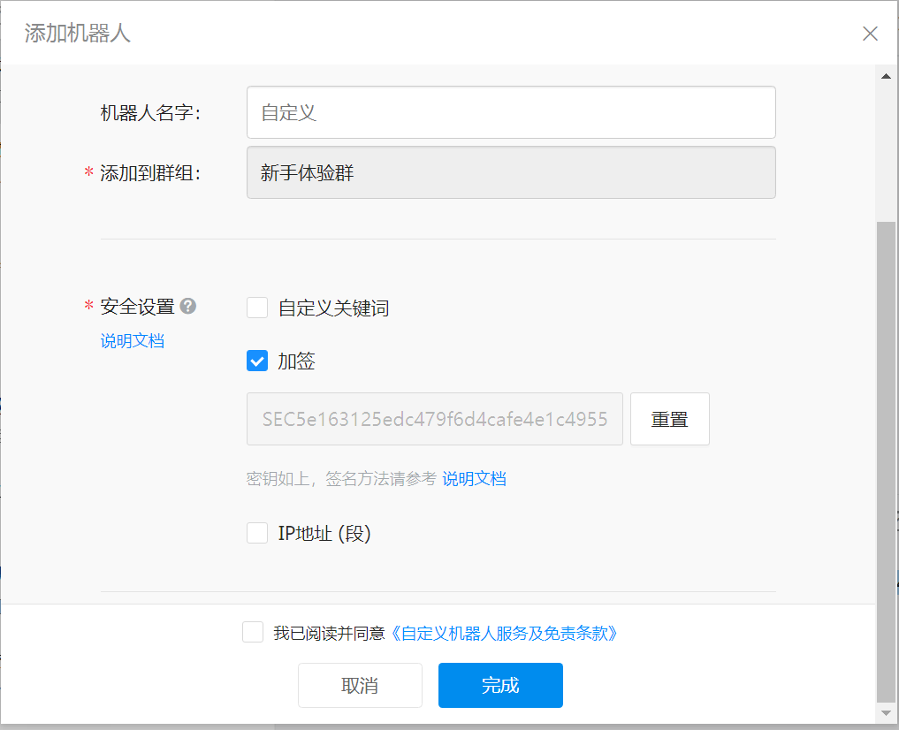
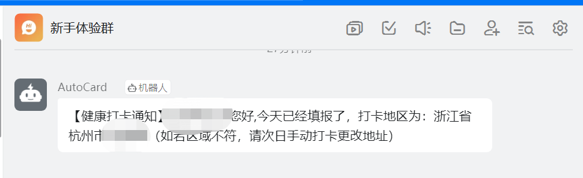
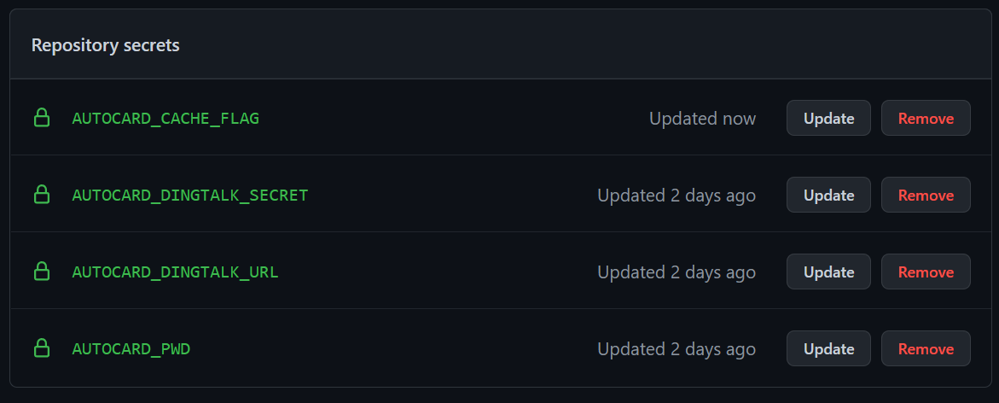
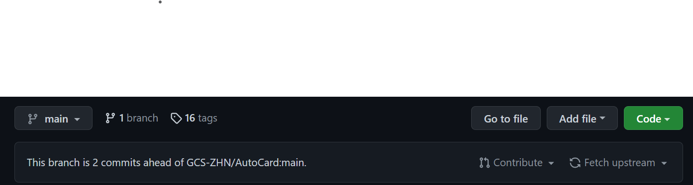
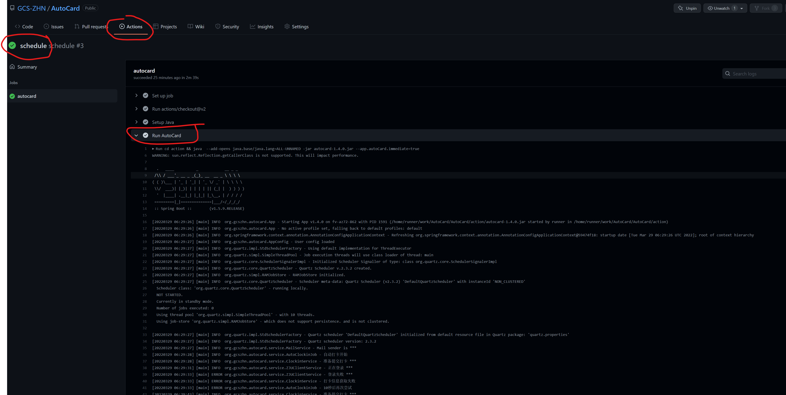

<h1 style="text-align: center">浙江大学自动健康打卡AutoCard</h1>
<div style="text-align: center">


[](https://github.com/GCS-ZHN/AutoCard/)
[](https://github.com/GCS-ZHN/AutoCard/)
[](https://gitee.com/GCSZHN/AutoCard/)

</div>

---
## 一、项目概述
本项目为解决浙江大学每日重复的健康打卡而开发，在完成首次手动打卡后，可以自动进行定时打卡。并通过邮件形式提醒通知打卡结果。本项目使用spring-boot、quartz和httpclient开发，使用maven进行项目管理，编译版本为jdk-14.0.2。支持多账户配置，支持利用github action。支持钉钉和邮箱推送打卡结果。如果没有服务器资源，请跳至[三、基于github-action的使用](#三基于github-action的使用)。可以选择d4_ocr或者tesseract_ocr作为OCR引擎识别验证码。

## 二、基于自建平台的使用
**STEP 1 用来跑程序的设备**

定时打卡任务意味着程序需要一直保持运行，因此个人建议将项目运行在一台服务器上。阿里云、华为云、腾讯云等都提供许多服务器租赁。当然，你要是保持个人电脑一直不关，那么用个人电脑也OK。

**STEP 2 安装java语言**

正如所说，本项目是一个java项目（src文件夹源码文件是*.java），因此需要用户事先安装java语言。作者的发行版用的是jdk-14.0.2，即java SE 14.0.2，[官方下载地址](https://www.oracle.com/java/technologies/javase/jdk14-archive-downloads.html)。根据自己设备的操作系统选择对应的安装包即可（代码最低版本要求是jdk8)。

|安装包扩展名 |对应系统                                  |
|:--------------|:--------------------------------|
|deb               |Linux发行版的Debian/Ubuntu|
|rpm               |Linux发行版的CentOS             |
|dmg              |MacOS                                   |
|exe                |Win                                        |

**STEP 3 下载作者提供的发行版**

在[gitee](https://gitee.com/GCSZHN/AutoCard/releases/)或[github](https://github.com/GCS-ZHN/AutoCard/releases)的项目发行版页面，下载最新的发行版（autocard-XXX.zip，XXX为版本号）。并解压。可以看到解压后目录结构如下
```txt
--autocard-XXX/
----autocard-XXX.jar                    ## 核心java程序，是编译后打包的jar包
----startup.sh                          ## 在linux下，用于启动java程序的shell脚本
----shutdown.sh                         ## 在linux下，用于关闭java程序的shell脚本
----config/
------application.json                  ## 用户配置，如账号密码等
------log4j2.xml                        ## 日志配置，不用修改
------tessdata/                         ## 放置OCR模型数据
```
**STEP 4 修改application.json**

用任意文本编辑器打开config目录下的application.json，配置下列信息。
```json
{   
    //配置发送邮件通知的邮箱
    "mail":{
        //用来发送邮件的账号
        "username":"***",
        //发件名
        "nickname":"AutoCard", 
        //发件邮箱密码
        "password":"***",
        //SMTP邮件服务运营商服务器域名，默认浙大邮箱
        "smtp":"smtp.zju.edu.cn",
        //SMTP邮件服务端口
        "port":994
    },
    //配置多个打卡账号
    "jobs":[
        {
            //打卡的通行证账号1，即学工号
            "username":"***",
            //对应登录密码
            "password":"***", 
            //发送打卡结果的收件邮箱，如果不需要可以不配置
            "mail":"***",
            //cron表达式定时，示例为每天00:00:00，对github action无效
            "cron":"0 0 0 * * ? *",
            // 钉钉机器人webhook URL
            "dingtalkurl": "https://oapi.dingtalk.com/robot/send?access_token=****",
            // 钉钉机器人webhook 签名，如果没有可以不配置
            "dingtalksecret": "SEC****",
            //任务开启随机延时0-1800秒
            "delay":true,
            //任务最大重试次数，默认为3
            "maxtrial": 3
        },
        {
            //打卡的通行证账号2
            "username":"***",
            //对应登录密码
            "password":"***",
            //发送打卡结果的收件邮箱
            "mail":"***",
            //cron表达式定时，示例为每天02:00:00
            "cron":"0 0 2 * * ? *"
        }
    ],
    // 开启打卡前表单验证
    "formvalidation": true,
    // 是否开启预览功能特性
    "enablepreview": false
    // OCR引擎的选择，可选tesseract_ocr和d4_ocr
    "ocr": "d4_ocr"
}
```
邮箱用于打卡的通知，默认使用浙大邮箱，否则需要`mail.smtp`和`mail.port`参数配置为指定第三方邮箱如QQ邮箱的配置。若不配置邮箱信息，将不会邮件提醒。

可以配置钉钉机器人消息推送，方式如下：

 - 进入钉钉，选择一个用于接收消息的群，例如新手体验群
 - 进入群设置，添加**群智能助手**
 - 选择添加机器人
 - 选择自定义
 - 然后添加机器人，选择加签
 - 复制url和加签的密钥，保存在配置文件中





cron表达式是用于定时任务的经典表达式，该参数允许用户自定义打卡定时方式。网上有很多现成的表达式模板以及表达式在线生成工具。**默认定时设定是每天早上9点自动打卡**。网上有很多介绍或[在线生成器](https://cron.qqe2.com/)。cron表达式从左到右（空格分开）指的是“秒 分 时 每月第几天 月份 每周第几天 年份”，特殊符号表示通配。**对于多个打卡用户配置，建议定时错开，并发登录容易被浙大后台拒绝**
```txt
0 0 0 * * ? *      ## 每天00:00:00打卡
0 30 6 * * ? *     ## 每天06:30:00打卡
0 0 9 * * ? *      ## 每天09:00:00打卡
```
delay参数为true时，每次执行任务会随机延时0~1800秒，这样的好处在于每天打卡时间不固定。

**STEP 5 运行程序**

可以通过命令行或者注册为系统服务的方式来运行程序。对于命令行方式，在Windows下，常见的命令行是cmd和powershell，打开方式“WIN + R”，输入"cmd"或"powershell"，确定即可。linux服务器打开即是shell命令行页面（To小白：如何连接Linux服务器请自行百度一下，拥有服务器用户名、密码、IP、端口，通过ssh客户端访问）。

```shell
java -jar autocard-XXX.jar   # 方式一，在auotcard-XXX的解压目录下，直接通过java命令运行
....                         # 然后你会看到日志输出到屏幕，此方法仅适合不关闭命令行页面，在自己电脑跑
....                         # 如果希望避免命令行输出，请继续看下面将程序运行注册为系统服务的方式


bash startup.sh              # 方式二，运行上面说的shell脚本启动，但仅限于linux服务器。可以关闭服务器连接
....                         # 会弹出nohup的信息，直接enter下去就好
```

对于方式一，关闭命令行页面即为关闭程序。方式二请通过`bash shutdown.sh`关闭程序。还是推荐服务器上，用方式二运行。

通过方式一，运行正常可以看到下列日志输出屏幕。不论哪种方式，相同的程序日志会在`app.log`文件中看到。最后日志显示JVM running。（等到了打卡时间，日志会继续输出）


如果希望避免方式一中命令行的输出以及关闭命令行导致的程序停止运行，在Windows下可以将其注册为一个开机自启动的系统服务。接下来以位于`E:\autocard-1.4.7`路径下的`autocard-1.4.7.jar`和x64架构为例介绍具体细节，同时下文提到的所有脚本文件均可在项目的 `template` 文件夹中找到对应以`.temp`结尾的文件。

- 根据自己电脑架构去[官方仓库](https://github.com/winsw/winsw/releases)下载WinSW.Net4.exe(x64)或WinSW.Net2.exe(x86)到`E:\autocard-1.4.7`

- 安装[.Net Framework](https://dotnet.microsoft.com/en-us/download/dotnet-framework)

- 创建执行具体任务的脚本`start.bat`:

```bat
# windows的cd命令在切换位于不同盘的路径时需要先切换盘符
E:
cd E:\autocard-1.4.7
java -jar autocard-1.4.7.jar
```

- 在`E:\autocard_1.4.7`路径下创建一个和WinSW.Net4.xml(这里的文件名应当和你下载的WinSW.NetX.exe同名，X为4或2)，填写内容如下：

```xml
<service>
  <id>autocard_java</id>
  <name>autocard_java</name>
  <description>autocard_java</description>
  <!--该服务将执行的批处理文件所在路径-->
  <executable>start.bat</executable>
  <log mode="reset"></log>
  <!--jar文件所在文件夹的路径-->
  <workingdirectory>E:\autocard-1.4.7</workingdirectory>
</service>
```

- 在`E:\autocard_1.4.7`路径下分别创建用于安装、启动、暂停、卸载服务的脚本`service-install.bat`，`service-start.bat`，`service-stop.bat`，`service-uninstall.bat`如下：

```bat
#service-install.bat
WinSW.Net4.exe install
pause

#service-start.bat
WinSW.Net4.exe start
pause

#service-stop.bat
WinSW.Net4.exe stop
pause

#service-uninstall.bat
WinSW.Net4.exe uninstall
pause
```

- 若要启动服务，请先通过`service-install.bat`安装服务，而后通过`service-start.bat`启动服务，程序日志会输出到同文件夹下的`app.log`中。如果希望暂停服务，请通过`service-stop.bat`暂停服务。如果希望卸载服务，请先暂停服务，而后通过`service-uninstall.bat`卸载服务。


## 三、基于github action的使用
### 方式一：使用GitHub的仓库密钥
Fork本项目（右上角，喜欢的小伙伴麻烦顺手点star支持一下），在fork后的仓库里”Setttings > Secrets > Actions > New repository secret“添加下列仓库密钥（也是本地运行时的系统环境变量）。

- **AUTOCARD_USER**  打卡的用户
- **AUTOCARD_PWD**  打卡的密码
- **AUTOCARD_DINGTALK_URL** 打卡的钉钉推送URL
- **AUTOCARD_DINGTALK_SECRET** 打卡的钉钉推送密钥
- **AUTOCARD_DELAY** 是否随机延迟打卡
- **AUTOCARD_CACHE_FLAG** 用于程序缓存输出提供一个索引，任意值即可，例如设为1
- **AUTOCARD_MAX_TRIAL** 打卡失败最大重试次数，默认是3次

上述环境变量与前述配置文件的参数对应。AutoCard会读取这些环境变量，配置打卡用户。其相较于配置文件的优点在于，配置文件是在github开源显示的，二上述环境变量是加密的。但不支持多个账号配置。


如需修改定时，请修改.github/workflows/schedule.yml里的cron表达式，默认设定北京时间09:00。注意github用的是UTC标准时间，而中国是东八区。如果AutoCard项目有更新，可以点击绿色code按钮下面的**Fetch upstream**来拉取更新。当然最新版本的github action具备自动拉取更新的功能。



### 方式二：使用json配置文件
使用github的导入功能新建自己的AutoCard仓库。在action/config/application.json下添加添加如前文配置即可。此时注意将项目闭源。推荐使用方式一。

### 注意事项

注意：**请仓库检查开启了github action功能**，如果没有，请在当前项目的Settings>Actions>General下"allow all actions and reusable workflows"和点击Actions > schedule下启用workflows。（没有开启的页面有文字提示开启）

当action运行时，可以在项目的**Actions**选项下看到schedule这个工作流的运行记录，点击进去可以看到**Run AutoCard**下面就是程序执行日志。目前无法成功发送通知邮件，但不影响打卡实现。


- 如果想立即运行action，只需要star一下自己的项目即可触发。
- -如果学校打卡表单有更新，请修改上述的`AUTOCARD_CACHE_FLAG`这个密钥值（只要不和上一次一样就行，比如输入新的值为2，前一次为1）
- 如需要关闭表单更新检查，参考前文配置`formvalidation:false`。
- 使用github action打卡，邮件推送在github action中不可使用。

程序缓存在以下三种情况会被清除
- action/config/application.json配置文件被修改
- action/autocard.jar程序包被更新
- AUTOCARD_CACHE_FLAG值被修改

## 四、额外参数
- app.autoCard.cronExpresssion

该参数可以统一修改了默认的cron表达式。每个用户如果配置各自的cron，那么定时任然按照用户配置。注意示例中的引号。
```shell
java -jar autocard-XXX.jar "--app.autoCard.cronExpresssion= 0 0 7 * * ? *"
```
- app.zjuClient.cookieCached

该参数默认为false，设置为true则会启动cookie缓存。多用户配置时，此参数不要启用，否则会造成冲突登录。
```shell
java -jar autocard-XXX.jar --app.zjuClient.cookieCached=true
```

- app.autoCard.immediate

该参数指定为true时，即代表立即运行打卡任务，结束后自动退出程序。配置github action的定时功能，可以实现定时打卡。

## 五、自己打包
若用户需要使用低版本如jdk 1.8，需要在对应版本（安装对应版本jdk并修改pom.xml中版本信息）下重新编译打包maven项目（要求用户得安装了[maven](https://maven.apache.org/download.cgi)），建议配置maven工具的镜像为阿里云（这样首次打包时下载依赖库会快一点，[阿里云教程](https://maven.aliyun.com/mvn/guide)）。

1. 克隆或下载本项目

在github或gitee中，都提供了项目的clone、fork或者直接下载zip，下载完成后进入目录。

利用git工具，命令行下克隆项目
```shell
git clone https://gitee.com/GCSZHN/AutoCard.git
git clone https://github.com/GCS-ZHN/AutoCard.git
```
2. 修改pom.xml
```xml
<maven.compiler.source>你的java版本</maven.compiler.source>
<maven.compiler.target>你的java版本</maven.compiler.target>
```
用任意文本编辑器编辑pom.xml，修改上述配置。

3. 运行打包脚本
```shell
bash build.sh         ## linux
powershell build.ps1  ## windows
```
根据平台，运行打包脚本。会产生一个release子文件夹。不过个人没有macOS，故没有编写macOS打包脚本，用户可以直接执行`mvn package spring-boot:repackage`打包生成jar文件，然后按照前面的目录结构放置。

## 六、可能的问题
- java.lang.reflect.InaccessibleObjectException

这是与java模块化有关的问题，采用java 16等很新的java版本可能会抛出，解答详细请看[相关issue](https://gitee.com/GCSZHN/AutoCard/issues/I42IF9)。修改时请将startup.sh中的java命令一并修改。

- refusing to allow a GitHub App to create or update workflow `.github/workflows/schedule.yml` without `workflows` permission

如果在action的日志的Sync with upstream看到上述错误，那是因为在自动获取最新AutoCard时，AutoCard作者修改了.github文件夹下面的东西，而更新当前仓库使用的默认授权token是secrets.GITHUB_TOKEN，它没有修改这个文件夹下面workflow的权限。
解决这个问题有两个办法：
1.  用上文提到的Fetch upstream手动完成此次更新(治标不治本)
2.  修改`.github/workflows/schedule.yml`文件，将其中的`target_repo_token: ${{ secrets.GITHUB_TOKEN }}`使用的token（令牌）换成扩大权限的自定义token，详细介绍和自定义令牌方法参见[Github官方文档](https://docs.github.com/cn/actions/security-guides/automatic-token-authentication#modifying-the-permissions-for-the-github_token)。配置新令牌的权限同[相关issue](https://github.com/aormsby/Fork-Sync-With-Upstream-action/issues/12)那样。然后将私人令牌作为前文一样的密钥设置，利用设置了一个MY_TOKEN的密钥，然后将上面的`GITHUB_TOKEN`替换为`MY_TOKEN`。

- 缺失libtesseract.so共享库
  

在linux环境中，如果选择使用tesseract-ocr引擎，需要自己部属安装tesseract，相关教程可以参考[tesseract-ocr主页](https://tesseract-ocr.github.io/tessdoc/Home.html)。

## 七、注意
若打卡题目被更新或者你的任何信息情况有变化（如返校），请先手动打卡一次。本项目仅供学习参考。使用时请确保信息的正确性。滥用造成的后果请自行承担。

## 八、更新记录
### v1.4.8
集成支持dddd-ocr（d4-ocr）和tesseract-ocr两种OCR引擎，其中d4-ocr是基于开源项目[sml2h3/ddddocr](https://github.com/sml2h3/ddddocr)提供的预训练模型onnx文件，本人将其用java封装了，不用调用python程序。并修复了相关[issue](https://github.com/GCS-ZHN/AutoCard/issues/16)。
### v1.4.7
2022年5月7日，学校引入图片验证码，特发布此次更新支持验证码识别。同时修复了相关issue的BUG。
### v1.4.6
修复了相关[issue](https://github.com/GCS-ZHN/AutoCard/issues/11)，支持了设置最大重试次数。
### v1.4.5
修复了在获取照片异常时引起的空指针异常。

### v1.4.4
对钉钉通知信息引入markdown格式增强，新增预览特性（看到自己的照片hhh，默认不开启预览特性，想要自我欣赏的可以设置`enablepreview: true`启用）。

### v1.4.3
支持对健康打卡进行表单数据校验，检测健康打卡表单是否更新，当表单校验不通过，意味着健康打卡已经更新，请清除数据缓存`autocard_cache.json`文件并重启打卡程序。例如2022年4月6日浙江大学对表单有所更新。

### v1.4.2
修复了多用户立即打卡时，后续用户无效的问题。支持了通过系统环境变量来配置打卡用户。

### v1.4.1
支持了钉钉消息推送，可以自定义钉钉机器人接收消息。

### v1.4.0
支持了即时打卡，加入了github action支持，用户可以利用github action功能来使用github服务器进行打卡。但暂时无法收到邮件通知。

### v1.3.9
修复报错“从下列地区返回浙江格式错误”和代码优化。

### v1.3.8
修复了打卡后，前端页面显示在境外的问题。实际上这并不影响打卡实际定位，但由于undefined和空字符串""在javascript中的不同，前端页面会显示在境外。

### v1.3.7
该版本修正了2021年11月9日学校健康打卡平台前端格式变换引起的BUG，同时在打卡信息提示上引入了当前打卡地点的提示。自动打卡是作用是解放手动，但若信息变化，请如实手动打卡更改。

### v1.3.6
近期，直接登录[浙大通行证](https://zjuam.zju.edu.cn/cas/login)，即使登录成功，也无法顺利进入[我的浙大服务](service.zju.edu.cn)，从而导致Connection Timeout情况的出现而打卡失败，因此做出此次更新。

### v1.3.5
引入了打卡的随机延时，使得每天打卡时间相对不固定。

### v1.3.4
修复了打卡地区发生变化时的小Bug。打卡地区发生变化时请自行打卡（注意先关掉打卡程序或先于打卡定时时间）。

### v1.3.3
2021年8月5日，学校健康打卡平台代码逻辑有变化（感兴趣去看一下它JS源码），AutoCard进行针对性升级。原先版本会一直提示重复打卡。

## 九、更新计划
- [ ] 支持从命令行获取配置信息
- [X] 支持利用github仓库secrets获取配置
- [ ] 支持Sock5代理

## 十、反馈
任何使用问题，欢迎加入[Telegram交流群](https://t.me/zjuers)交流。喜欢的小伙伴就给个star支持一下吧。
